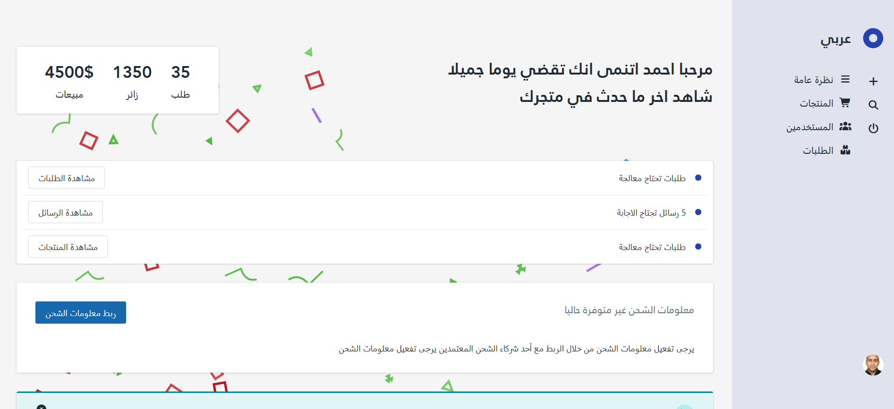

# 📊 لوحة تحكم إدارية (Admin Dashboard)

لوحة تحكم إدارية متعددة الصفحات (Multi-Page Application) مبنية باستخدام **Vite** و **Handlebars** و **SCSS** و **Vanilla JavaScript**. تم تصميمها باللغة العربية (RTL) بهيكل منظم واحترافي يعتمد على معمارية **ITCSS** وإعادة استخدام المكونات.

---
## 📸 Screenshots

### Desktop




## 🚀 التقنيات المستخدمة (Tech Stack)

* **Build Tool & Bundler:** [Vite](https://vitejs.dev/) - لتجربة تطوير سريعة وتجميع أمثل للملفات (Rollup Multi-Page Setup).
* **HTML Templating:** [Handlebars (vite-plugin-handlebars)](https://handlebarsjs.com/) - لتقسيم الواجهة إلى مكونات وقوالب قابلة لإعادة الاستخدام (Partials & Layouts).
* **Styles / CSS:**
  * ** ITCSS (Inverted Triangle CSS):** تنظيم تدرج الخصوصية (Specificity) وتقسيم الشيفرة إلى طبقات معيارية (`config`, `base`, `components`, `pages`, `utilities`, `hacks`).
  * [Sass (SCSS)](https://sass-lang.com/) لكتابة تنسيقات متقدمة ومتجاوبة مع نمط تسمية منظم (BEM-like).
  * [PostCSS Preset Env](https://preset-env.cssdb.org/) لتحويل خصائص الـ CSS الحديثة وضمان التوافق مع مختلف المتصفحات (Stage 2 & Autoprefixer).
  * [Normalize.css](https://necolas.github.io/normalize.css/) لتوحيد الأنماط الافتراضية عبر المتصفحات.
* **JavaScript:** Vanilla JavaScript (ES Modules) بدون أطر عمل إضافية للحفاظ على خفة وسرعة الأداء.
* **Data Visualization:** [Chart.js](https://www.chartjs.org/) لتمثيل بيانات ومخططات المبيعات برسوم بيانية تفاعلية.

---

## 🛠 المميزات والصفحات المنفذة (Implemented Features)

- **بنية متعددة الصفحات (Multi-Page Application):** إعداد Vite Build لإنتاج صفحات مستقلة:
  - الصفحة الرئيسية / لوحة الإحصائيات (`index.html`)
  - إدارة المنتجات وإضافة منتج (`products.html`, `add-product.html`)
  - إدارة المستخدمين وإضافة مستخدم (`users.html`, `add-user.html`)
  - إدارة الطلبات (`orders.html`)
- **نظام القوالب المعياري (Modular Partials):** عزل العناصر المتكررة مثل القائمة الجانبية (Sidebar)، الجداول، الترويسات، والتنقل داخل `src/partials` لتطبيق مبدأ (DRY).
- **هيكلة أنماط ITCSS الاحترافية:** فصل واضح للمتغيرات والإعدادات العامة عن أنماط المكونات والصفحات الخاصة لمنع تضارب الـ Specificity.
- **تفاعلية الواجهة (DOM Interactions):**
  - رسم بياني مخصص للمبيعات باستخدام Chart.js مع ضبط المحاور بما يتناسب مع الواجهة العربية.
  - إغلاق التنبيهات والبانرات مع تأثير حركي سلس (Smooth Collapse Transitions).
  - تفاعلية رفع الصور ومعاينتها الفورية في نموذج إضافة منتج.
  - دعم كامل للغة العربية والاتجاه من اليمين لليسار (RTL).

---

## 📂 هيكل المشروع (Project Structure)

```text
├── src/
│   ├── partials/         # مكونات وقوالب Handlebars المشتركة (Sidebar, Layout, Tables)
│   ├── scripts/          # منطق الجافاسكربت (Chart, Upload Preview, Events)
│   └── main.js           # نقطة الدخول الرئيسية لملفات الجافاسكربت
├── public/
│   ├── styles/           # ملفات SCSS مقسمة وفق معمارية ITCSS
│   │   ├── config/       # Variables, Layout settings, Colors
│   │   ├── base/         # Typography, Fonts, Global styles, Links
│   │   ├── components/   # UI Components (Buttons, Sidebar, Tables, Banners)
│   │   ├── pages/        # Page-specific styles
│   │   ├── utilites/     # Mixins, Spacing helpers
│   │   ├── hacks/        # Specific overrides
│   │   └── style.scss    # ملف التجميع الرئيسي
│   ├── images/           # الصور والأصول
│   └── fonts/            # الخطوط المحلية
├── index.html            # الصفحة الرئيسية (Dashboard)
├── products.html         # صفحة قائمة المنتجات
├── add-product.html      # صفحة إضافة منتج
├── users.html            # صفحة قائمة المستخدمين
├── add-user.html         # صفحة إضافة مستخدم
├── orders.html           # صفحة قائمة الطلبات
├── vite.config.js        # إعدادات Vite ومسارات البناء وقوالب Handlebars
├── postcss.config.js     # إعدادات PostCSS و PostCSS Preset Env
└── package.json
```

---

## 💻 التشغيل والتثبيت محلياً (Getting Started)

### المتطلبات المسبقة:
* [Node.js](https://nodejs.org/) (الإصدار 18 أو أحدث)
* `npm` أو أي مدير حزم مكافئ

### خطوات التثبيت:

1. استنساخ المستودع (Clone Repository):
   ```bash
   git clone <REPO_URL>
   cd control-panel-vite
   ```

2. تثبيت الحزم (Install Dependencies):
   ```bash
   npm install
   ```

3. تشغيل خادم التطوير (Run Dev Server):
   ```bash
   npm run dev
   ```

4. بناء المشروع للإنتاج (Production Build):
   ```bash
   npm run build
   ```

5. معاينة ناتج البناء (Preview Build):
   ```bash
   npm run preview
   ```

---

## 👤 المطور (Author)
* الاسم: **[اكتب اسمك هنا]**
* حساب GitHub: `@[حسابك]`
* LinkedIn: `[رابط حسابك]`
